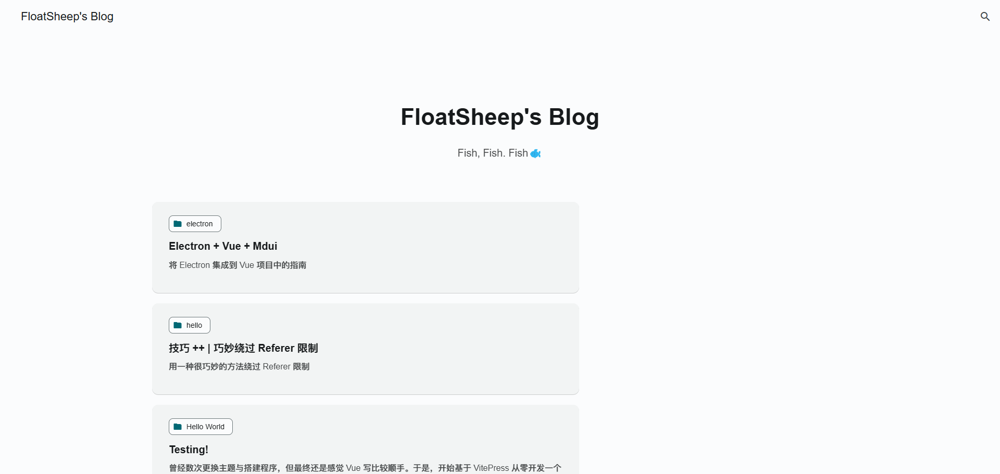

# PROJECT-BLOG-V3

## About the blog

This is a brave attempt.

I'll use `VitePress` and `Material Design User Interface(MDUI)` to build my new blog.

## Project silhouette

Silhouette of April 20, 2024

## Todo

- [x] Create Framework
- [x] Finish the renderer of all posts
- [x] Finish the dynamic color picker
- [ ] Add comment system
- [ ] Add friends, articles, tags, categories and so on pages
- [ ] Add the bar beside the posts list
- [ ] And so on...

I only want to record what I want to remember.